# Developing Policies and Workflows

Before setting up your preprint server, it is recommended that you decide what policies and workflows you want to use. This will determine how you configure the settings and what you communicate to authors and readers. This chapter outlines the areas to consider in establishing policies and workflows.

## Theme or Discipline

Similar to a journal, your preprint server can have a thematic or discipline focus. This can be conveyed in your Server Settings. If you want to post preprints in multiple disciplines and have different policies and workflows for the different collections, you could consider running multiple OPS servers on a single OPS installation. Otherwise, you can use Categories to organize the preprints into thematic collections on a single OPS server.

## Submission

Because preprints do not undergo a formal peer review process and are often posted with little moderation, it is important to define acceptance criteria for your preprint server and decide who can make a submission and how. Generally, the author has more control over the process than they would when submitting to a journal. You can decide whether authors can self-post the pre-print to the public site immediately upon submission, or if you will use a screening process. OPS has some special plugins which facilitate this. See the [Website Settings chapter](./setup#website-settings) for more information.

User access settings can be configured so that anyone can create a user account and make a submission or so that a Server Manager must create new user accounts. You can choose a configuration depending on how open you want the submission process to be. Some preprint servers allow submissions from journals and/or from authors. See [Users and Roles chapter](./users-roles).

If you have an open submission policy, consider [ways to prevent spam](/admin-guide/en/securing-your-system#managing-spam).

## Moderation

Although OPS does not have a formal review process, preprints can be screened or moderated. There are two types of moderation: pre-moderation and post-moderation. Servers using pre-moderation will accept or reject preprints upon submission, while servers using post-moderation will accept or reject preprints after they have already been submitted and made public.

## Revision, withdrawal, and removal

Most preprint servers allow new versions of the manuscript to be uploaded by authors, so that authors can update their papers based on new experiments, community feedback received, or feedback received from a journal-based peer review process.

In OPS you can publish multiple versions of a preprint and have all versions available to the public. OPS will show automatically when a new version is published but will not show if a preprint was withdrawn or removed. The Server Manager should indicate if a preprint was withdrawn or removed, or if there is relevant commentary or peer review available.

Withdrawal is not currently possible in OPS but may be available in the future.

## Data

Publishing research data with preprints can help build trust. In OPS, authors can upload data files as supplemental files that can be published alongside preprints. However, the best practice is to strongly encourage researchers to link to data held in external repositories and include the citation in the reference list, rather than require that data files be uploaded directly to the preprint server. The data may be more discoverable in a repository and the author will not need to re-upload the data when they submit the article to a journal for publication.

## Communicate your policies

It is recommended that you publish your policies on your site under Server Settings, Workflow Settings, and on static pages as needed. Clear policies can increase reader trust in the preprints you post and can help authors understand your acceptance criteria and moderation and posting policies and practices.

You can also create an FAQ which summarizes your policies and communicates them in simple language to your authors and readers. You may want to include general information about preprints in your FAQ. You can use the Static Pages plugin to create and publish an FAQ (see [Learning OJS 3 - Website Settings - Static Pages](/learning-ojs/settings-website#static-pages)).

Here are examples of preprint servers’ FAQs:

- [SCIELO Preprints FAQ](https://preprints.scielo.org/index.php/scielo/faq)
- [OSF Preprints FAQ](https://help.osf.io/hc/en-us/articles/360019930493-Preprint-FAQs)
- [bioRxiv FAQ](https://www.biorxiv.org/about/FAQ)

# Users and Roles

OPS has 4 default roles that will be explained in more detail below. Users have the option of creating additional roles using the Create New Role function.

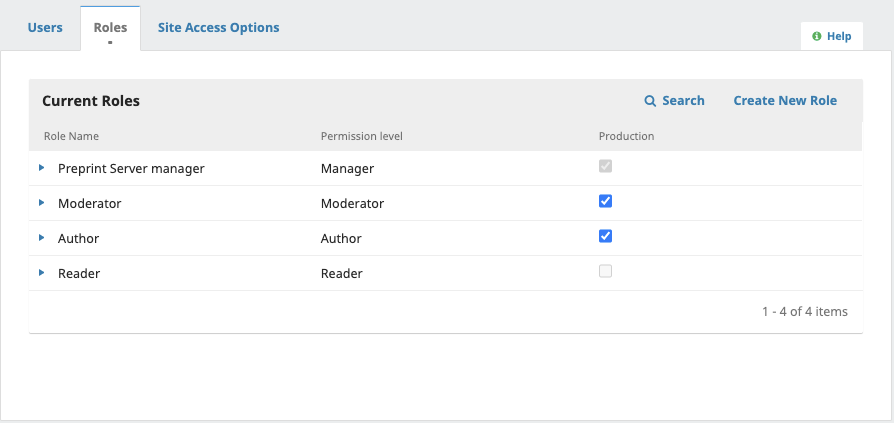

## Preprint Server Manager

The Preprint Server Manager is responsible for setting up the server web site, configuring the system options, and managing the user accounts. This does not involve any advanced technical skills, but entails filling out web-based forms and uploading files.

The Preprint Server Manager also has the ability to enroll other users within the Server.

The Preprint Server Manager also has access to the Servers’ other management features, and can create new Sections for the Server, edit the default Emails, view statistics and reports, import and export data, and access the editorial workflow and all submissions.

## Moderator

The Moderator reviews and accepts or declines submissions assigned to them. May also correspond with authors and/or other moderators through the system and edit submissions prior to posting. They have the ability to record decisions as well as to schedule and finalize the metadata for posting.

## Author

Authors are able to submit manuscripts to the Server directly through the Server’s website. The Author is asked to upload submission files and to provide metadata or indexing information (the metadata improves the search capacity for research online and for the journal). The Author can upload multiple files, in the form of data sets, research instruments, or source texts that will enrich the item, as well as contribute to more open and robust forms of research and scholarship.

If permissions have been granted, the Author will be able to provide updates and make changes to the metadata provided during the submission.

## Reader

The Reader role is the simplest role in OPS, and has the fewest capabilities. They will be able to access and read content if the Server provides online access to content in the distribution settings.

## Edit or Add a Role
From the Roles tab, you can grant or remove access to the Production stage by checking or unchecking the relevant stage.

You can create new roles by clicking the “Create New Role” button, or edit an existing role by clicking the blue arrow next to a role and selecting “Edit”.

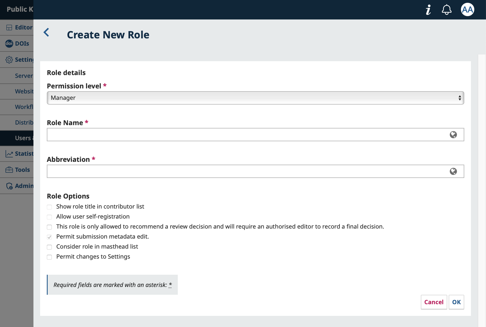

**Permission Level**: As described in the previous section, this indicates the level of permissions granted to this role.

**Role Name**: You can use this field to rename any role easily.

**Abbreviation**: Each role must have a unique abbreviation. This is used as a short identifier for participants.

**Role Options**: Configure specific options related to the role.
- Show role title in contributor lists: Users with this role will have their title included in the contributor list when making submissions.
- Allow user self-registration: Allow users to register freely for this role. Useful for allowing users register as Authors or Reviewers. Be very careful not to enable this option for roles that have access to sensitive information, such as Editors or Journal Managers.
- This role is only allowed to recommend a review decision and will require an authorised editor to record a final decision: Enable this to limit a role’s ability to make editorial decisions.
Consider role in masthead list: Select this to automatically include anyone with this role on the list of Editorial Board members.
- Permit changes to Settings: Select this to allow the role access to all journal settings and configurations.

## Invite a New User
Email configuration must be completed by a system administrator for the system to send invitation and registration confirmation emails to users. See the Administrator’s Guide for more information.

While users can self-register accounts for roles like Reader and Author (or other roles specified by you in the previous section), you can also invite users to take on new roles. This is especially useful for you to invite members of your Editorial Board to have the right permissions they need to work in your press.

From Settings > Users & Roles, click Invite to a Role.

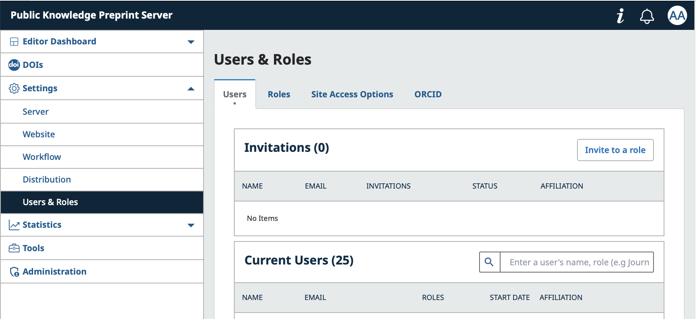

First, you’ll be asked to search for the user. You can enter their email, username, or ORCID to ensure that they’re not already registered. If they aren’t, you’ll be prompted to invite them.

Enter their email, first and/or last name, and select the role(s) you wish to assign them. You can use the “Add Another Role” button to assign multiple roles. The user can also self-register for additional roles later from their user settings. Enter a start date for the role and choose whether it should appear on the masthead (the automatically generated page listing Editorial Masthead).

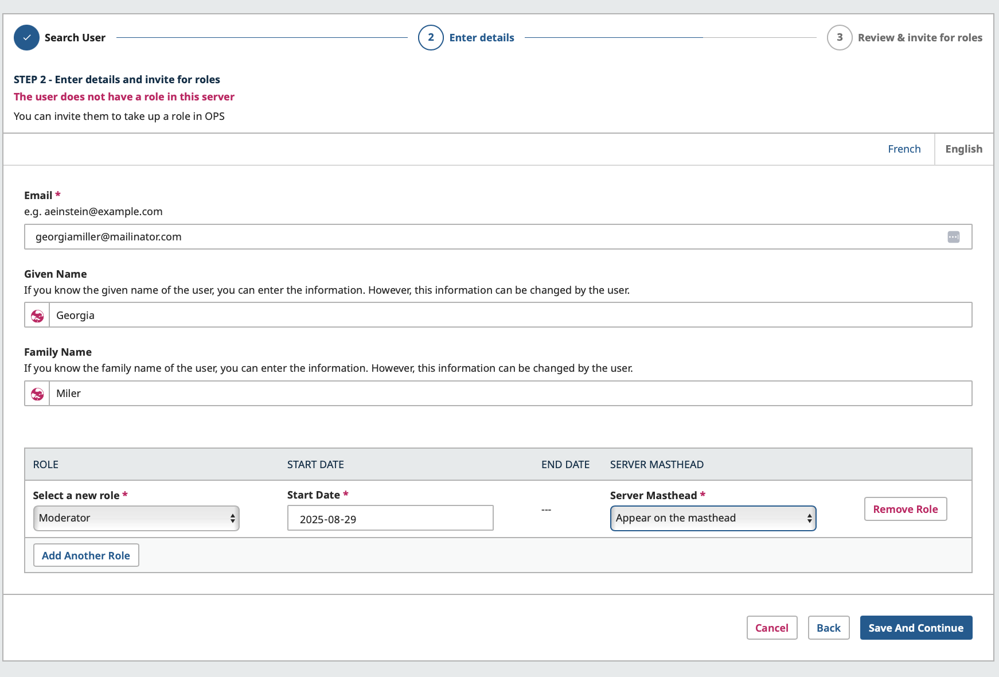

Click Save and Continue. On the final screen, you can preview and edit the email message that will be sent to the invitee.
When you are ready, click “Invite user to the role”.

You can see the status of the invitation from the Invitations list. You can edit your invitation (to add or adjust roles), or cancel your invite.

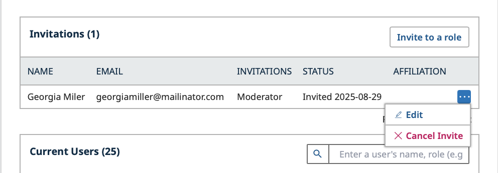

## Add and Remove Roles from a User 
Once a user has self-registered or accepted an invite, you can edit their profile to adjust their roles. Just like sending an invite, you can select a start date and choose whether the user will appear in the Server Editorial Masthead.

To edit a user:
1. Navigate to Settings > Users & Roles
2. Search for the user you wish to assign a role to under Current Users, click the three dots, and select *Edit*
3. Click Add Another Role
4. Select a new role
5. Choose a Start Date
6. Indicate whether this user should appear on the Server Masthead
7. Click Save and Continue

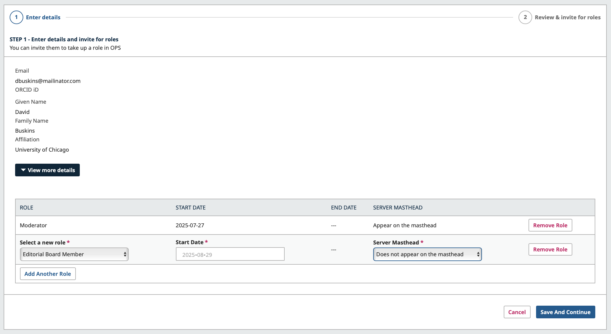

If a user is set to appear in the Journal Masthead, their name and affiliation will be displayed in the Editorial Masthead section.

When you remove a role from a user, the End Date will automatically be set to the current date. If you select the user to appear in the Server Masthead, their name and affiliation will be displayed in the Editorial Masthead section of the press.

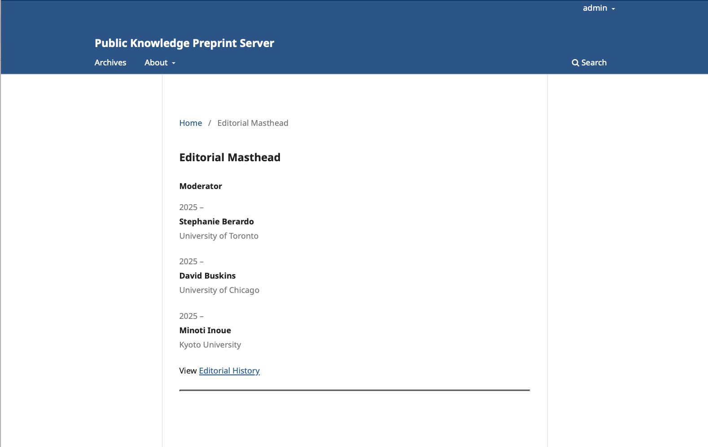

The role end date will be automatically registered when the role is removed from the user.

## Permission to Edit Metadata

### Granting Author permissions

In OPS, the Preprint Server Manager can grant access to allow authors and Moderators to make metadata changes prior to the manuscript being posted. There are two ways editors can grant this type of access.

**Global permission**- will grant all users with the role ‘author’ and/or ‘moderators’ permission to make metadata changes.

To enable this, go to Users & Roles > Roles. Click the blue arrow beside the ‘Author’ then click edit.

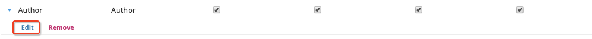

Under Role Options, enable **‘Permit submission metadata edit.’** then click OK.

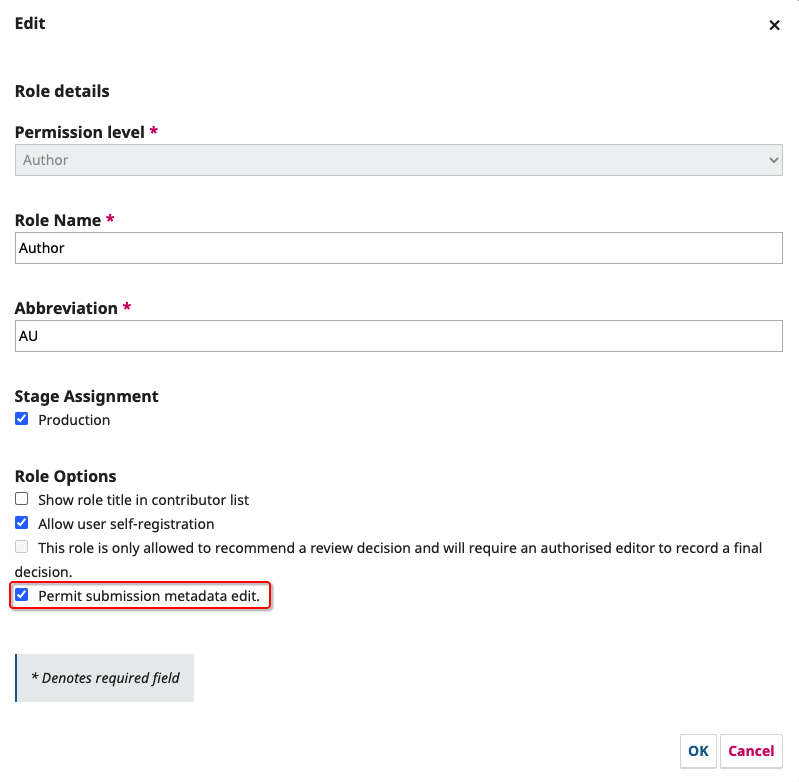

**Limited Permission**- will grant registered authors (typically a single author) permission to make one-time or short-term changes.To allow an author to make a change in the metadata, find their name under the participant list followed by Edit.

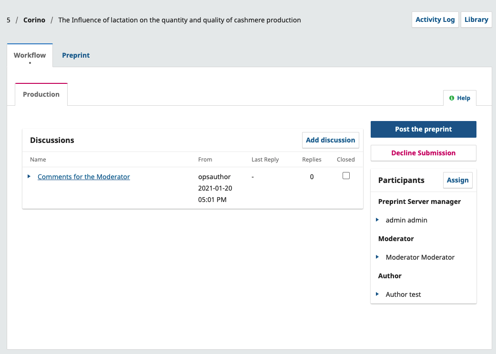

Under Permissions, enable **‘Allow this person to edit publication details.’** followed by OK.

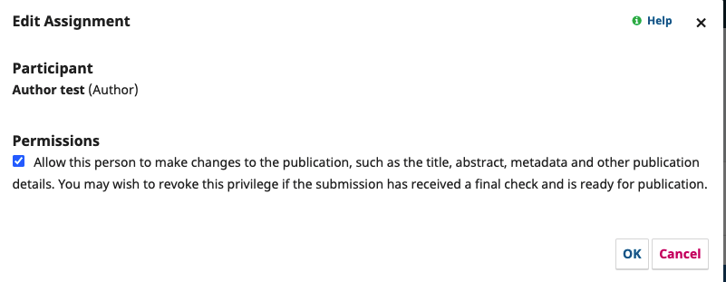

Once the author has been granted access to make edits they will be able to make changes to the metadata mentioned in the box.

Authors wishing to make changes to the relations field of their submission should contact the Server Manager.

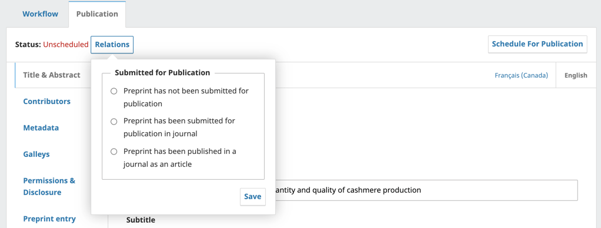

# Statistics

This chapter of Learning OPS provides a general overview of statistics available in Open Preprint Server (OPS). For more detailed information on statistics and usage guidelines, please see the Statistics chapter on the [Learning OJS](/learning-ojs/statistics).

There are a number of identified improvements that will be made towards statistics specific to Server Preprints for future releases.

## Preprints

The Preprints section provides a visual display as well as a table format of preprint activity.  The visual graphic can be changed from Monthly or Daily view. While the table format will allow you to filter the Total in ascending or descending order. As well as changed to view Abstract and File activity.

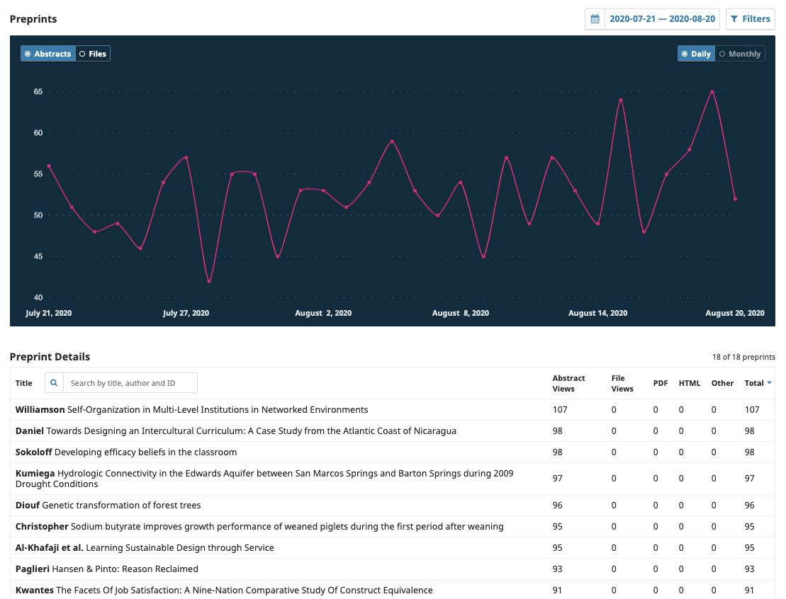

There are also a number of filters that can be used including date range and section. The search bar under Preprint Details can be used to search for the activity of a specific preprint manuscript.

### Geographical and Institutional Statistics

When Geographical and Institutional Statistics have been enabled (see the [Administrator's Guide](https://docs.pkp.sfu.ca/admin-guide/en/statistics) for details), OPS can collect data about the readers' locations and institutions for statistical reporting. To access these reports, click "Download Report" and choose the report you wish to access.

This information is also available via the COUNTER SUSHI interface. See the [Administrator's Guide](https://docs.pkp.sfu.ca/admin-guide/en/statistics#counter) for details.

## Editorial Activity

The Editorial activity statistics provides a visual graph and trend table with a summary of the editorial activity for your Server. This can be filtered for a specific date range.

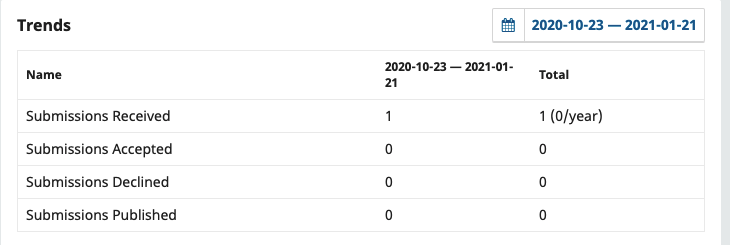

## Users

Provides a summary of the number of users registered in your server and by roles.

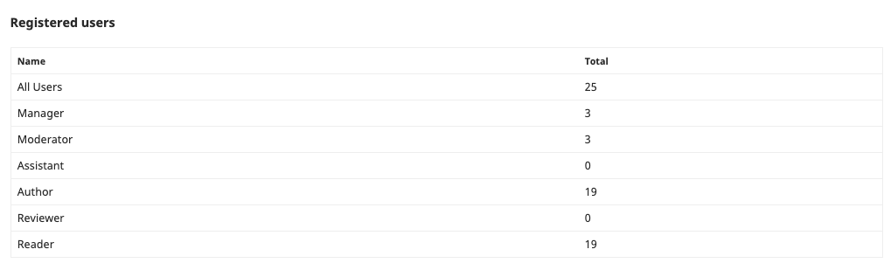

## Reports

The Reports page provides access to a variety of reports from your preprint server. The list may be expanded by installing additional plugins. For information on how to use and configure statistics in OPS, see the relevant section in [Learning OJS](/learning-ojs/statistics#reports).
